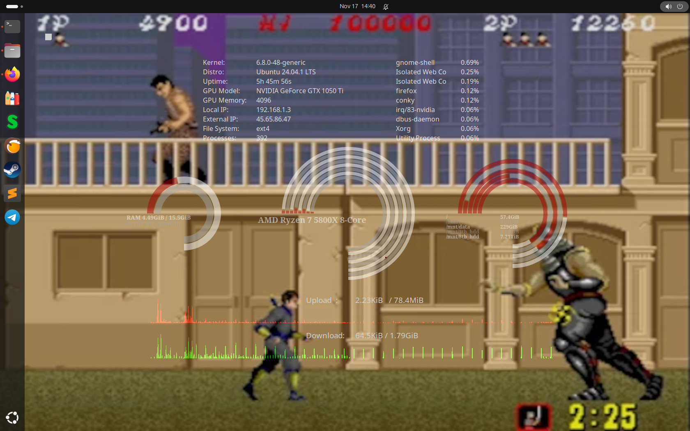

My attempt to get conky and lua to display system settings,
   inspired/developed from: https://github.com/deeptoaster/conky-rings 
                            https://github.com/mustafaozhan/GoogleIntegratedSystemConky 

  

